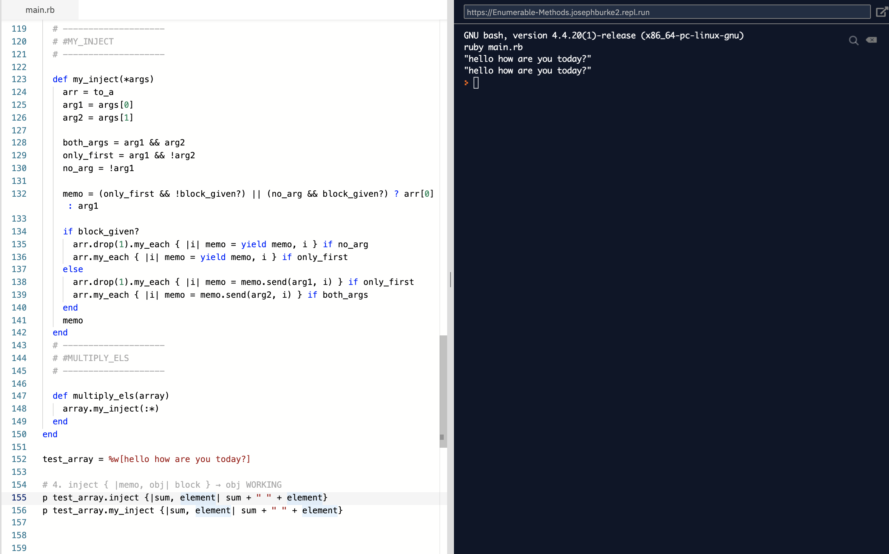

# Enumerable Methods

For this project, we have produced our own versions of a number of common methods in Ruby's Enumerable module: 

- #my_each - a method which behaves like #each. This method was then used within the other methods we created.
- #my_each_with_index - a method which behaves like #each_with_index
- #my_select - a method which behaves like #select.
- #my_all? - a method which behaves like #all?.
- #my_any? - a method which behaves like #any?.
- #my_none? - a method which behaves like #none?.
- #my_count - a method which behaves like #count.
- #my_map - a method which behaves like #map. This method was also modified to accept either a proc or a block.
- #my_inject - which behaves like #inject.
- #multiply_els - which uses #my_inject to multiply elements accumulatively.

Every method has been tested on hashes, arrays and ranges to mirror the behaviour of the methods they were modelled from.

## Built With
- Ruby
- VSCode & Atom
- Rubocop

## Live Demo

To quickly see our project in action, visit the [live demo](https://repl.it/@JosephBurke2/Enumerable-Methods#main.rb) on repl.it.

## Getting Started

### Prerequisites

To get this project up and running, you must already have **Ruby** installed on your computer.

### Installation

**To get this project set up on your local machine, follow these simple steps:**

1. Open Terminal.

2. Navigate to your desired location to download the contents of this repository.

3. Copy and paste the following code into the Terminal:

    git clone https://github.com/Joseph-Burke/Enumerable-Methods

4. Hit enter.

5. Once the repository has been cloned, you can now open the main.rb file and use some of the methods we have created! Enjoy!

## Authors

👤 **Joseph Burke**

- Github: [@Joseph-Burke](https://github.com/Joseph-Burke)
- Twitter: [@__joeburke](https://twitter.com/__joeburke)
- LinkedIn: [Joseph Burke](https://www.linkedin.com/in/joseph-burke-b7a8261a5)

👤 **Aye Daniel**

- Github: [@Alaska01](https://github.com/Alaska01)
- Twitter: [@AyeAsoo](https://twitter.com/AyeAsoo)
- Linkedin: [Daniel Asoo Aye](https://www.linkedin.com/in/daniel-asoo-aye-178500140/)

## 🤝 Contributing

The best way you can contribute to this project is by submitting an [issue](https://github.com/Joseph-Burke/Enumerable-Methods/issues) to help us improve it!

## Show your support

If you've read this far, you must like the project! Give us a ⭐️!

## Acknowledgments

- Our thanks to Microverse and all our peers and colleagues there.

## 📝 License

This project is [MIT](lic.url) licensed.
